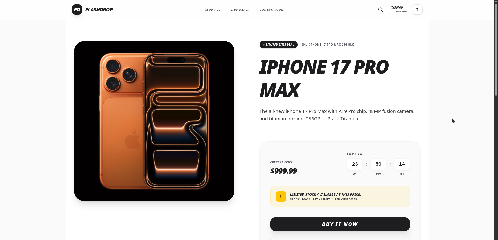
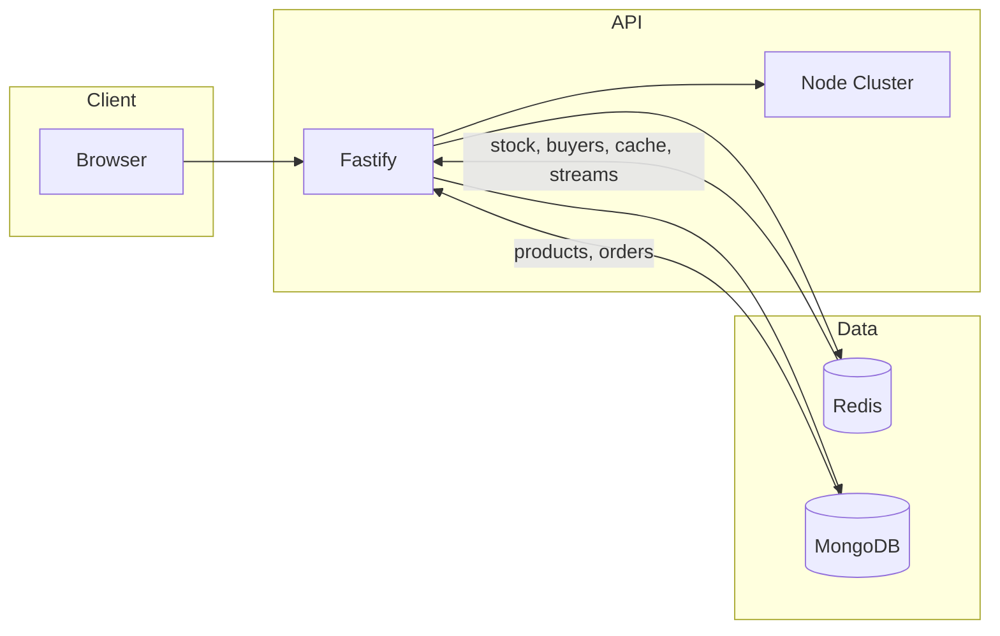
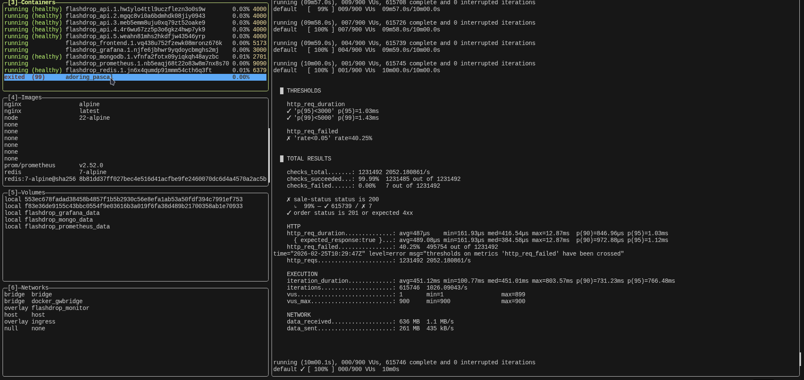
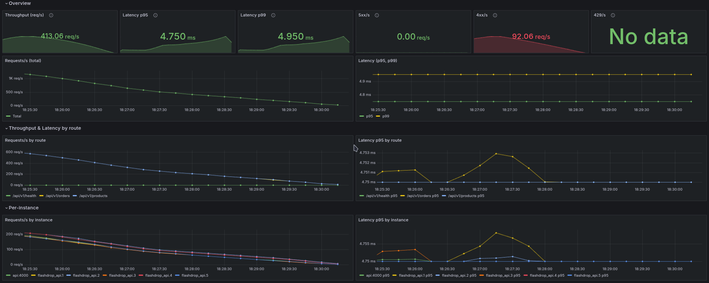
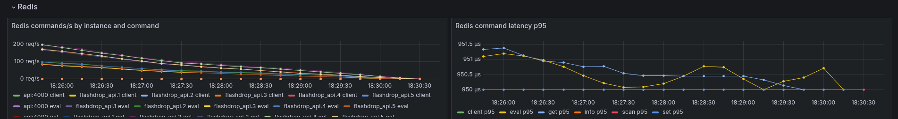
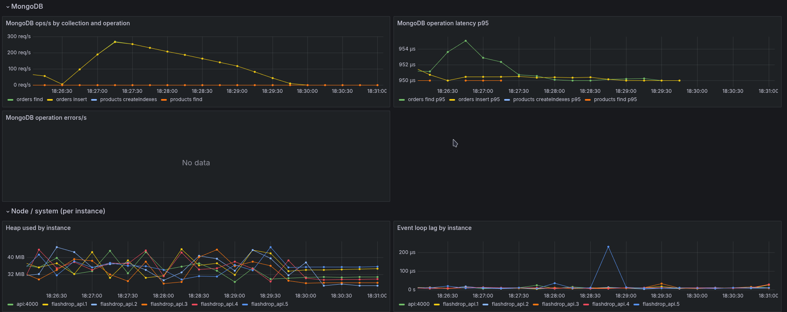

# Flashdrop




High-throughput flash sale platform: single product, limited stock, one item per user. Built for the take-home assessment: configurable sale window, strict inventory and one-per-user enforcement, API + simple React frontend, with stress tests and observability.

## What's inside

Monorepo (pnpm + Turborepo):

- **apps/api** — Fastify API, Node cluster, MongoDB, Redis. Handles sale status, orders, auth; uses Lua in Redis for atomic stock and per-user limit.
- **apps/frontend** — React (Vite) UI: sale status, user identifier (login), Buy Now, purchase feedback.
- **packages/schema** — Shared Zod schemas and types (Product, Order, SaleStatusResponse, etc.).
- **packages/logger**, **packages/utils**, **packages/typescript-config** — Shared tooling.


## Tech stack

- **Frontend**
  - **Vite + React** — SPA frontend for the flash sale UI.
  - **shadcn/ui + Tailwind CSS** — Design system and utility-first styling.
  - **TanStack Query** — Data fetching, caching, and request state (sale status, orders).
  - **React Context API** — Lightweight client-side state for user identity/session.

- **Backend**
  - **Node.js + Fastify** — High-performance HTTP server for the flash sale API.
  - **Zod** — Runtime validation and shared schemas (via `packages/schema`) across API and UI.
  - **Redis + Lua** — Atomic stock and per-user limit enforcement; Redis as source of truth during the sale.
  - **Redis Streams** — Async, non-critical flows like stock reconciliation.
  - **MongoDB** — Durable storage for products and orders.

- **Monitoring & metrics**
  - **Prometheus** — Scrapes API metrics from `/metrics`.
  - **Grafana** — Dashboards for throughput, latency, errors, rate limits, and stock gauges.

- **Stress testing**
  - **Autocannon** — Quick HTTP benchmarks for core endpoints.
  - **k6** — Scenario-based load tests (sale status, create order, mixed flows) with thresholds.


## Assumptions

- **Single product** — One flash sale product (by SKU) at a time; stock and limits are per product.
- **User identity** — A user identifier (e.g. username or anonymous id) is supplied via the UI or API and stored in a cookie/session; no full authentication service.
- **Sale window** — Start and end times are configured on the product; the system rejects purchases outside that window.
- **Local or self-hosted infra** — MongoDB and Redis are run locally or in Docker; Production-ready deployment configuration is available via docker swarm config. (docker-stack.yml)


## Design choices and trade-offs

- **Redis + Lua** for atomic stock decrement and per-user limit (no oversell, one per user); works across horizontally scaled API instances (shared Redis).
- **Node cluster** for throughput (multiple API workers).
- **Cookie/session** for user identity (after login or anonymous id).
- **Sale-status endpoint** cached in Redis with short TTL for freshness without hitting DB every poll.
- **Rollback Lua** when order persistence to MongoDB fails, so Redis stays consistent.
- **Optional global rate limiter** (off by default for stress testing).

Full rationale, fairness vs simplicity, and Redis Streams for async reconciliation: [docs/system-design.md](docs/system-design.md).

## Out of scope

- **Auth service and full auth features** — No OAuth, SSO, password reset, or user registration; identity is a simple identifier for “one per user” enforcement.
- **Checkout and payments** — No cart, checkout flow, or payment gateway (e.g. Stripe); a successful “order” is a reserved/purchased unit, not a paid transaction.
- **Multi-product or catalog** — Focus is a single product flash sale; product listing and search are minimal or omitted.
- **Email/notifications** — No order confirmation emails or push notifications.

## System diagram



Details: [docs/system-design.md](docs/system-design.md).

## Prerequisites

- Node ≥18
- pnpm
- Docker
- MongoDB and Redis (local or Docker)

## Build and run

```bash
pnpm install
```

Configure environment (e.g. for the API, in `apps/api` or via root `.env`):

| Variable | Description |
|----------|-------------|
| `DATABASE_URL` | MongoDB connection string (required for API) |
| `REDIS_URL` | Redis connection string (required for API) |
| `PORT` | API HTTP port (default `4000`) |
| `HOST` | API bind address (default `0.0.0.0`) |
| `ENABLE_GLOBAL_RATE_LIMITER` | Set to `true` to enable global rate limiting (default off for stress tests) |
| `API_URL` | Used by frontend and stress scripts (e.g. `http://127.0.0.1:4000`) |

Seed the database and Redis (required before running the app):

```bash
pnpm seed
```

Run API and frontend:

```bash
pnpm dev
```

Or run separately:

- API: `pnpm dev --filter=api` (default port 4000)
- Frontend: `pnpm dev --filter=frontend` (Vite default, e.g. 5173)

With Docker Compose (from repo root):

```bash
docker compose up
```

Check `docker-compose.yaml` for service ports and env.

**Production build and Swarm deploy**

To produce a production-ready build and run the stack under Docker Swarm in one go (e.g. for take-home evaluation), use the run-production script. From repo root:

```bash
./scripts/run-production.sh [--api-replicas N] [--run-k6]
```

e.g
```bash
./scripts/run-production.sh --run-k6
```

On Windows use PowerShell: `.\scripts\run-production.ps1 [-ApiReplicas N] [-RunK6]`. See [scripts/README.md](scripts/README.md) for options and prerequisites.

## API endpoints (quick reference)

| Method | Path | Description |
|--------|------|-------------|
| GET | `/api/products/:sku/sale-status` | Sale status for a product (cached): upcoming / active / ended, stock, limit per user, price, etc. |
| GET | `/api/products/:sku` | Product details by SKU |
| POST | `/api/orders` | Create order (body: `{ sku, quantity }`); requires session (user identity) |
| GET | `/metrics` | Prometheus metrics (no auth) |

User identity is established via cookie/session (e.g. after submitting a username on the frontend or via API).

## Tests

Type-check and run API tests:

```bash
pnpm run check-types
pnpm --filter=api test
```

Tests live in `apps/api/src` (Vitest): route tests, service tests, middleware tests.

## Stress tests

**Autocannon** (quick benchmarks):

- `pnpm bench:get-sale-status` — GET sale-status
- `pnpm bench:get-product` — GET product by SKU
- `pnpm bench:create-order` — POST orders (unique user per connection)

**k6** (staged load, thresholds):

- `pnpm stress:sale-status` — GET sale-status only
- `pnpm stress:create-order` — POST orders (unique user per iteration)
- `pnpm stress:mixed` — GET sale-status then POST order when active

Env: `API_URL` (default `http://127.0.0.1:4000`), optional `SKU`. Prerequisites: API, MongoDB, and Redis running; `pnpm seed`; sale window active for order tests.

**Expected outcome:** No overselling (successful orders ≤ initial stock). Under load, 409 (out of stock) and 403 (limit exceeded) are expected once stock or per-user limit is exhausted; 400 when the sale window is not active.

k6 details and Docker: [scripts/k6/README.md](scripts/k6/README.md).


### Sample Stress Test Results




### Metrics Dashboard

#### High-throughput and latency


#### Redis
 

#### MongoDB and Node perf.
 


### View ore detailed stress tests results: [stress-test-result](docs/stress-test.md)


## Documentation

- [System design](docs/system-design.md) — Architecture, flows, fairness vs queue/reservation, Redis Streams, concurrency, scalability, fault tolerance, configuration.
- [Data diagram](docs/data-diagram.md) — Data model, Redis keys, MongoDB entities, API shapes.
- [Monitoring and observability](docs/monitoring.md) — Prometheus, Grafana, dashboards, credentials, instance identity, production notes.
- [Docs index](docs/README.md)

## Monitoring and observability

The API exposes **Prometheus** metrics at `GET /metrics`. With Docker Compose, **Prometheus** and **Grafana** run alongside the app:

- **Prometheus**: http://127.0.0.1:9090 (scrapes API metrics every 15s).
- **Grafana**: http://127.0.0.1:4001 — pre-provisioned dashboards under the **Flashdrop** folder (e.g. throughput, latency, errors, rate limits, Redis/Mongo, flash sale stock).
  - **Login**: username `admin`, password `admin` (change on first use; override via env in production).

Details (credentials, metrics list, multi-replica identity, rate limiter, production): [docs/monitoring.md](docs/monitoring.md).

For multi-replica deployment (e.g. Docker Swarm), use `docker-stack.yml` and ensure Prometheus and Grafana are configured for your environment; see [docs/monitoring.md](docs/monitoring.md) and `prometheus/prometheus.yml` for scrape config.

