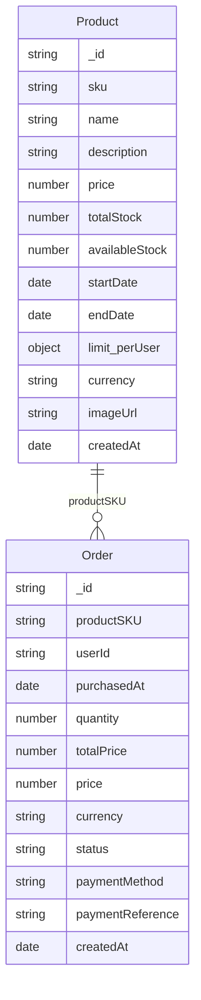

# Data diagram

## Overview

- **MongoDB**: Product catalog (one collection) and durable order records (one collection). Products define sale window (startDate, endDate), totalStock, and per-user limit; orders record userId, productSKU, quantity, price, status.
- **Redis**: Live stock counter and per-user purchase count during the sale (used by Lua); product and sale-status caches; order-completion stream for async reconciliation.

## Entities (MongoDB)

- **Product**: Identified by `sku`. `startDate` / `endDate` define the flash sale window; `totalStock` is the initial quantity; `limit.perUser` caps how many units one user can buy (typically 1). `availableStock` in MongoDB is reconciled asynchronously from Redis after each order (Redis is source of truth during the sale).
- **Order**: One row per successful purchase. `userId` + `productSKU` are unique in practice (enforced by Redis + Lua before insert). `status` is e.g. "completed".

## Redis key layout

| Key pattern | Type | Purpose |
|------------|------|---------|
| `product:{sku}` | String (JSON) | Cached product document. TTL ~1 hour. |
| `product:{sku}:stock` | String (integer) | Live available quantity during sale. Decremented by Lua on purchase; rolled back on failure. |
| `product:{sku}:buyers` | Hash (userId → quantity) | Per-user purchase count for this product. Updated by Lua; used to enforce limit per user. |
| `product:{sku}:sale-status` | String (JSON) | Cached sale-status response (status, dates, stock, limitPerUser, sku). Short TTL (~10s). |
| `products:list:{hash}` | String (JSON) | Cached list of products for GET /products. |
| `stream:order` | Stream | Order-completion events. Subscriber consumes and reconciles MongoDB product stock. |

Keys use `{sku}` literally in the code (e.g. `product:{${sku}}:stock`); the table above uses `{sku}` as a placeholder for the product SKU.

## Relationships

- **Product ↔ Order**: One product (by SKU); many orders per product. At most one order per user per product (enforced in Redis by the Lua script before creating the order document).
- **Stock**: During the sale, Redis `product:{sku}:stock` and `product:{sku}:buyers` are the source of truth. MongoDB `Product.availableStock` is updated asynchronously by the order-completion subscriber (reconciliation).

## API response shapes

The API and frontend share types from **packages/schema**:

- **Product**: `productSchema` / `Product` — full product document (GET /products, GET /products/:sku).
- **Order**: `orderSchema` / `Order` — order document (POST /orders response, GET /orders, GET /orders/:productSKU).
- **Sale status**: `saleStatusResponseSchema` / `SaleStatusResponse` — minimal fields for GET /products/:sku/sale-status (status, startDate, endDate, availableStock, totalStock, limitPerUser, sku).

For exact field definitions and validation, see the schema package source; this doc summarizes layout and relationships only.
