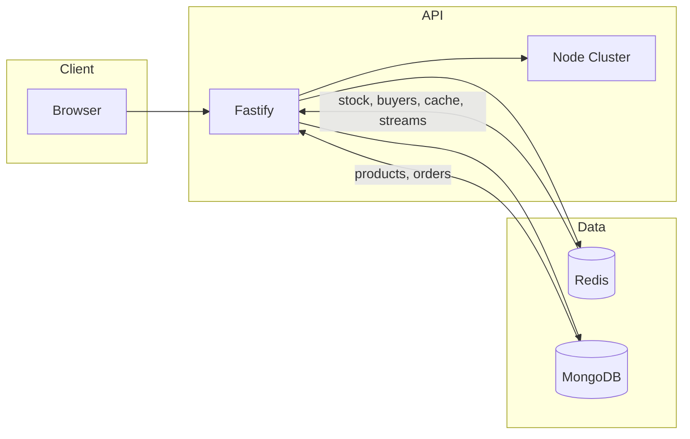

# System Design

## Overview

Flashdrop is a high-throughput flash sale backend: one product, limited stock, one item per user. The browser talks to a Fastify API that uses **Redis** for live stock and per-user limits and **MongoDB** for products and durable orders. Sale-status reads are cached; the purchase path is synchronous (Lua + DB write) with an optional Redis Stream used only for asynchronous reconciliation.

High level: **Client → API (Fastify, optional Node cluster) → Redis (stock, buyers, cache, streams) + MongoDB (products, orders)**.

## Architecture diagram

- **Client**: React frontend; user identity via cookie/session (e.g. after login or anonymous id).
- **API**: Fastify server; can run with Node cluster for multiple workers. Stateless;
- **Redis**: Source of truth during the sale for available stock and per-user purchase count (Lua scripts); also used for product/sale-status cache and for an order-completion stream (async reconciliation).
- **MongoDB**: Product catalog and durable order records. Product documents define sale window and limits; orders are written synchronously on purchase.

## Request flows

### Sale status

- **GET** `/api/v1/products/:sku/sale-status`
- Response: minimal status (upcoming / active / ended), dates, available/total stock, limit per user, sku.
- Flow: Check Redis cache key for sale-status (short TTL). On miss: load product (cache or DB) and Redis stock key; compute status from dates and stock; cache and return. Product display (name, image, price) comes from **GET** `/api/v1/products/:sku` when needed.

### Purchase

- **POST** `/api/v1/orders` with body `{ productSKU, quantity }` and user id (e.g. cookie).
- Flow:
  1. Validate product is within flash sale window (start/end).
  2. Validate request quantity vs product per-user limit.
  3. Run Lua script in Redis: atomically decrement stock and increment buyer count; reject with -2 (out of stock) or -1 (limit exceeded) if conditions not met.
  4. Persist order in MongoDB (synchronous).
  5. Publish "completed" event to Redis Stream (async subscriber reconciles MongoDB stock).
  6. On any failure after step 3: run rollback Lua to restore Redis stock and buyer count.

## Fairness and design options (trade-offs)

### Alternatives considered

1. **Reservation-based**  
   User gets a time-limited reservation (token/slot), then must confirm (e.g. payment or confirm endpoint) within the window.  
   - Pros: Can improve perceived fairness (reserve then confirm).  
   - Cons: Expiry, reclaim, and double-confirm add complexity; abandoned reservations can block stock briefly.

2. **Queue-based**  
   All purchase attempts go into a queue (Kafka, RabbitMQ, Redis Streams); a worker consumes in FIFO order and allocates stock.  
   - Pros: Strict fairness (first in queue wins); natural backpressure.  
   - Cons: Higher latency (enqueue + worker); more operational complexity (queue and consumer scaling, replay, DLQ).

3. **Chosen: simplicity (synchronous, atomic allocate)**  
   Single path: validate sale window and per-user limit → one Lua script that atomically decrements Redis stock and increments buyer count → persist order in MongoDB (synchronous) → publish to Redis Stream for downstream reconciliation. No reservation step; no queue for allocation. Whoever’s request is applied by the Lua script first gets the item.

### Trade-offs of the chosen approach

| Approach        | Fairness       | Complexity | Latency   |
|----------------|----------------|------------|-----------|
| Reservation    | Medium (slots) | High       | Higher    |
| Queue-based    | High (FIFO)    | High       | Higher    |
| Chosen (atomic)| Best-effort    | Low        | Lower     |

- **Simplicity**: One code path, fewer components, easier to operate and debug.
- **Latency**: No extra round-trips for reserve-then-confirm or queue.
- **Fairness**: No strict global FIFO; allocation is “first request that wins the Lua execution.”
- **Reliability**: Synchronous order persistence; on DB failure we roll back Redis (Lua rollback) so we do not oversell.
- **Throughput**: Critical section is minimal (Lua in Redis); hot-path limit is DB write latency.

## Redis Streams for async, non-critical paths

### What is implemented

After an order is **synchronously** persisted to MongoDB, the API publishes a `"completed"` event to a Redis Stream (order-completion). A **subscriber** (in the same API process) consumes the stream in batches and runs **reconciliation**: it decrements MongoDB’s `availableStock` for the product so it matches the fact that stock was already decremented in Redis during the Lua step. Redis is the source of truth for live stock during the sale; MongoDB is updated asynchronously for durability and reporting.

The stream is **not** used to decide who gets stock; it is used only for reconciliation and non-critical side effects.

### Trade-offs

- **Pros**: Client does not wait for reconciliation (lower latency); subscriber can catch up after restarts (stream retention, consumer group); batch reconciliation reduces DB load.
- **Cons**: MongoDB stock is eventually consistent with Redis; if the subscriber falls behind, MongoDB can be stale until catch-up. Acceptable because Redis remains the authority for “can this user buy?”
- **Reconciliation tactic**: Subscriber aggregates completed orders by product and applies a single update per product per batch (e.g. `reconcileProductStock(sku, -quantity)`).

## Concurrency and correctness

- **Lua script**: A single script in Redis atomically reads stock and buyer count, checks stock and per-user limit, then decrements stock and increments buyer count. Concurrent requests cannot oversell or violate the one-per-user rule because the script runs atomically per key.
- **Rollback**: If order persistence to MongoDB fails after the Lua step, a rollback Lua script restores Redis stock and buyer count so the system remains consistent and no stock is “lost” to failed writes.
- **No oversell**: Allocation is decided only in Redis via Lua; MongoDB is updated synchronously for the order record and asynchronously for product stock (reconciliation).

## Scalability

- **Stateless API**: No in-process state for allocation; scaling is horizontal (e.g. Node cluster or multiple instances behind a load balancer).
- **Redis as source of truth**: Stock and per-user limits live in Redis during the sale; all workers see the same state.
- **Caching**: Product and sale-status responses are cached in Redis with appropriate TTLs to reduce DB and computation load.

## Fault tolerance

- **Rollback script**: Restores Redis state when order persistence fails.
- **Redis Streams consumer**: Order-completion events are durable; the subscriber can process after restarts and catch up.
- **Cache TTLs**: Short TTL for sale-status keeps responses fresh; product cache can be longer.
- **Optional rate limiter**: Global rate limiter can be enabled via env; disabled by default for stress testing.
